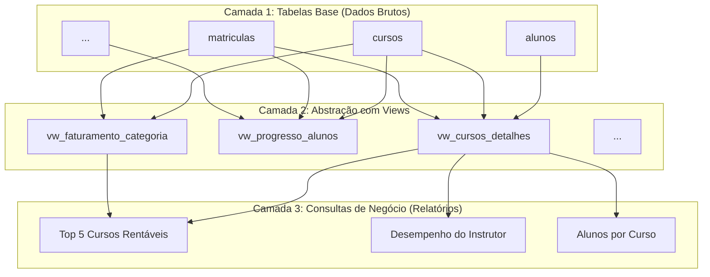

# Arquitetura e Fluxo de Dados do Projeto

Este documento descreve, através de diagramas, os principais fluxos de trabalho do projeto EduTech, desde a geração dos dados até a sua carga e consulta no banco de dados.

---

## Fluxo 1: Geração e Exportação de Dados

O primeiro passo do processo é a criação de dados fictícios. O script `data_generator.py` é responsável por gerar dados realistas para todas as tabelas do banco de dados e exportá-los para arquivos no formato CSV, que servirão como fonte para a carga no banco.

```mermaid
graph TD
    A[Início] --> B(Executar data_generator.py);
    B --> C{Gerar Dados Fictícios};
    C --> C1[gerar_categorias];
    C --> C2[gerar_instrutores];
    C --> C3[gerar_alunos];
    C --> C4[gerar_cursos];
    C --> C5[gerar_modulos_e_aulas];
    C --> C6[gerar_matriculas];
    
    subgraph Exportação
        D[exportar_para_csv]
    end

    [C1, C2, C3, C4, C5, C6] --> D;
    D --> E[Arquivos .csv salvos em /edutech/data];
    E --> F[Fim];
```

---

## Fluxo 2: Validação e Carga para o Banco de Dados

Com os arquivos CSV gerados, o script `main.py` orquestra o segundo fluxo. Ele carrega os dados, executa uma série de validações (de formato, tipos e integridade referencial) e, se tudo estiver correto, realiza a carga desses dados no banco de dados PostgreSQL de forma eficiente usando o comando `COPY`.

```mermaid
graph TD
    A[Início] --> B(Executar main.py);
    B --> C[Carregar CSVs para DataFrames];
    C --> D{Validar Dados};
    D --> D1[validar_csv (formato, tipos)];
    D --> D2[validar_fks (integridade)];
    D1 & D2 --> E{Existem Erros?};
    E -- Sim --> F[Exibir Erros e Parar Execução];
    E -- Não --> G[Conectar ao Banco de Dados PostgreSQL];
    G --> H{Loop de Inserção};
    subgraph "Para cada tabela na ordem correta"
        I[dump_tabela via COPY FROM STDIN];
    end
    H --> I;
    I --> H;
    H -- Concluído --> J[Banco Populado com Sucesso];
    J --> K[Fim]
```

---

## Fluxo 3: Arquitetura de Consultas SQL

Para facilitar a análise e a criação de relatórios, a arquitetura SQL foi dividida em camadas. As tabelas base armazenam os dados brutos. Sobre elas, foram criadas `VIEWs` que abstraem a complexidade dos `JOINs` e cálculos. Por fim, as consultas de negócio (relatórios) são executadas sobre essas `VIEWs`, tornando o processo mais simples, legível e manutenível.


