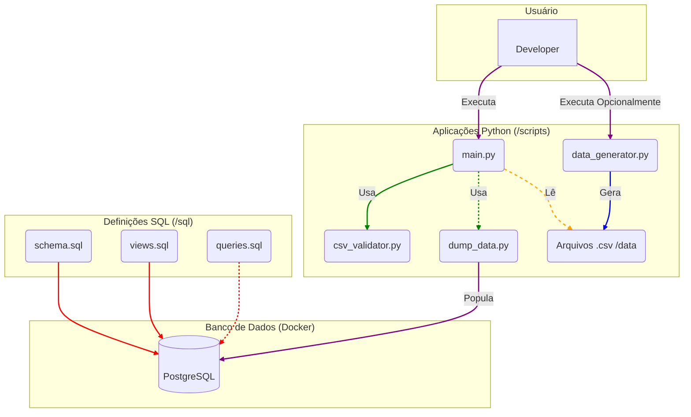

# Diagrama de Arquitetura do Projeto EduTech

Este diagrama apresenta uma visão de alto nível da arquitetura do projeto, mostrando seus principais componentes estáticos e as relações entre eles.

---

## Arquitetura Geral

O projeto é dividido em três grandes blocos:

1.  **Banco de Dados (Docker):** O PostgreSQL, containerizado com Docker, que serve como a camada de persistência dos dados.
2.  **Definições SQL (`/sql`):** Um conjunto de scripts que define a estrutura (`schema`), as abstrações (`views`) e as consultas (`queries`) do banco de dados.
3.  **Aplicações Python (`/scripts`):** Scripts responsáveis pela automação, incluindo a geração de dados, validação e o processo de carga (ETL) para o banco de dados.

### Legenda das Interações

- **Developer -> Scripts:** O desenvolvedor executa os scripts Python (`main.py` para o fluxo principal, `data_generator.py` opcionalmente).
- **Scripts Python:** O `main.py` orquestra a validação e a carga, lendo os arquivos `.csv` e utilizando o `dump_data.py` para popular o banco.
- **Definições SQL -> Banco:** Os scripts `schema.sql` e `views.sql` são usados para definir a estrutura e as abstrações dentro do banco de dados PostgreSQL.
- **Carga de Dados:** O script `dump_data.py` (Loader) tem a responsabilidade de se conectar ao banco e inserir os dados em massa.
- **Consultas:** O arquivo `queries.sql` contém as consultas de negócio que são executadas diretamente no banco de dados já populado.
